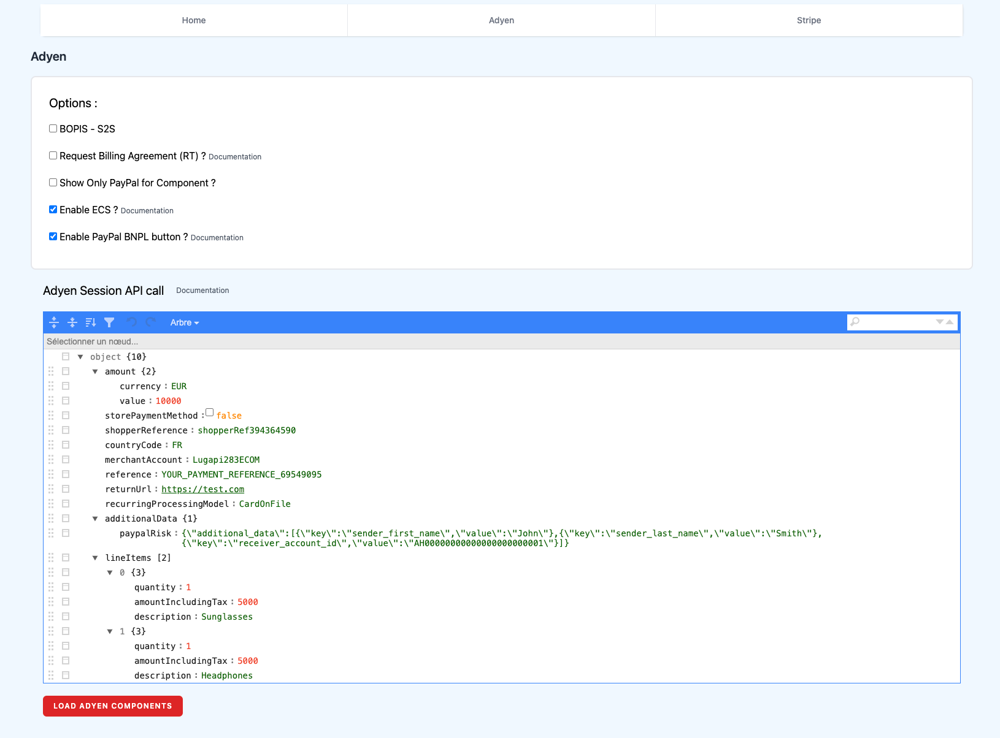
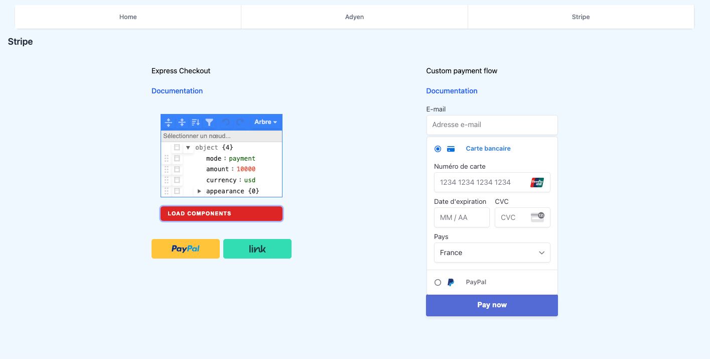

# PayPal via Adyen & Stripe

## Installation

1. Clone the repository: `git clone https://github.com/lugapi/PayPal_PSP_integration.git`
2. Install dependencies: `npm install`

## Configuration

Duplicate `.env.exemple` to a `.env` file at the root of the project and add the necessary environment variables.

## How to Run

To start the project, run the following command:

```bash
npm start
```

## How to Use

Go to /adyen or /stripe to test PayPal integrations


## PSP onboarding

## 1. Adyen

- Open an Adyen account and see .env.exemple to identify the needed credentials.
- Go to API credential settings in Adyen backoffice and add the localhost URL in Client settings options

## 2. Stripe

Open a Stripe account and see .env.exemple to identify the needed credentials.


## Screenshots

- Adyen


<br />

- Stripe

